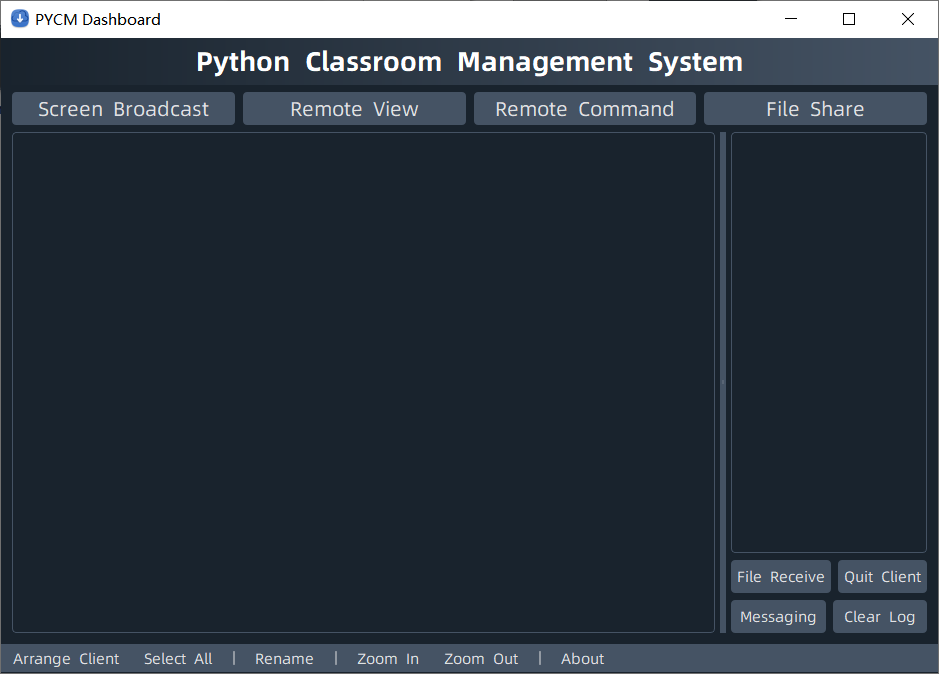
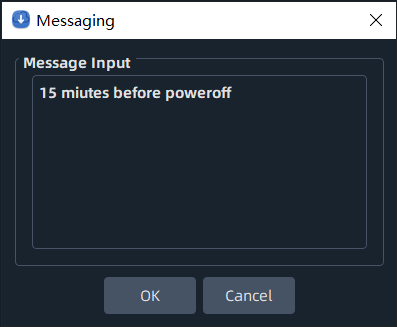
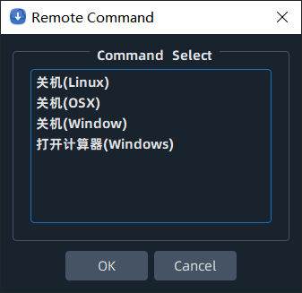
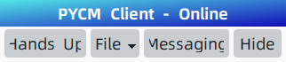
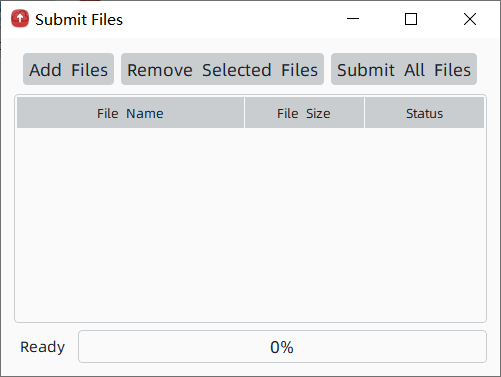

# Python Class Management System

[English](README.md) [简体中文](README.zh-CN.md)

## Mirror Repository

* [Github(Master)](https://github.com/yangzhongtian001/PYCM)
* [Gitee(Mirror)](https://gitee.com/yangzhongtian/PYCM)

## Introduction

This program is an e-classroom management system written by python.
It contains both `Client(student side)` and `Console(teacher side)`. GUI written by `PyQt5`, supporting all platforms.

## Features

* [x] Auto LAN discover
* [x] Console screen broadcasting
* [x] Cient screen spy on Console side
* [X] Console side file share
* [x] Client side file submitting
* [x] Console side message sending
* [x] Client side message sending
* [x] `PyInstaller` packaging

## Programs

* **Client:** Used for multiple users, ex: students, visitors.
* **Console:** Used for one host user, ex: teacher, host.

## Release Install Guide

* Download release version [here](https://github.com/yangzhongtian001/PYCM/releases).
* Run `ConsoleMain` or `ClientMain`

## Dev Install Guide

* Clone repository.
* Run `pip install -r requirements.txt` to install required libraries.
* Run `python ConsoleMain.py` or `python ClientMain.py` to start application.

## Screenshot

### Console

### Client

## Contact

* Author: Richard Yang
* School: China Beijing National Day School
* Club: HCC Computer Community

---

 

