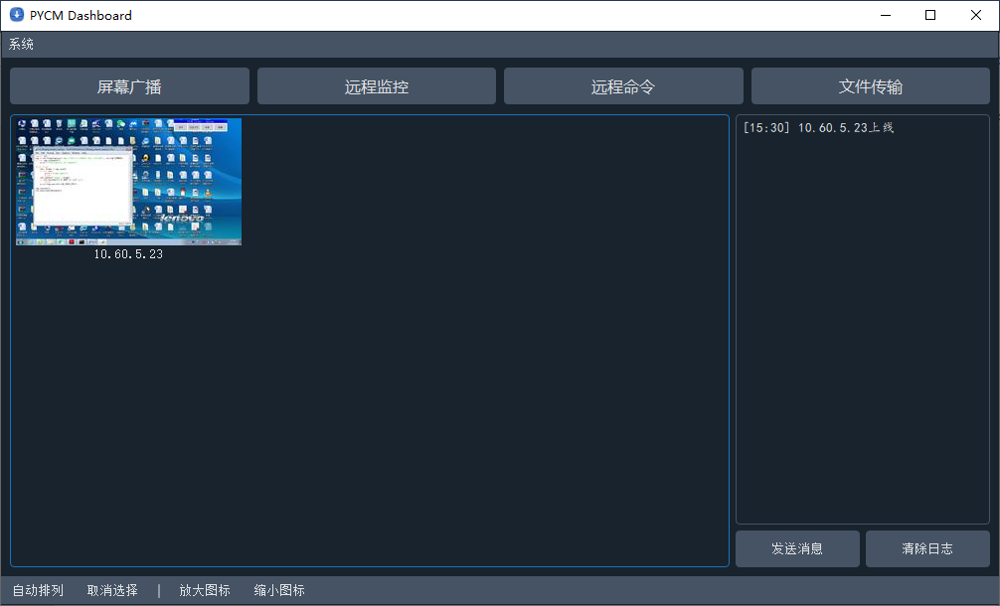
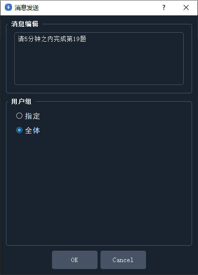
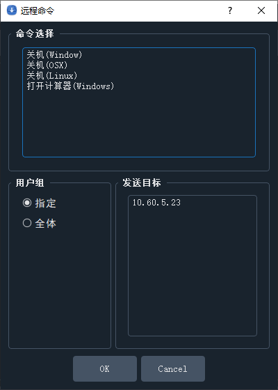
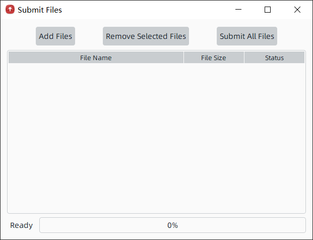

# Python Class Management System
[](https://github.com/yangzhongtian001/PYCM/releases) [](https://github.com/yangzhongtian001/PYCM/issues) [](https://github.com/yangzhongtian001/PYCM/network) [](https://github.com/yangzhongtian001/PYCM/stargazers) [](https://github.com/yangzhongtian001/PYCM)

## Mirror Repository
* [Github(Master)](https://github.com/yangzhongtian001/PYCM)
* [Gitee(Mirror)](https://gitee.com/yangzhongtian/PYCM)
* [Gitlab(Mirror)](https://gitlab.com/yangzhongtian/PYCM)
* [Coding(Mirror)](https://yangzhongtian.coding.net/public/PYCM/PYCM/git/files)

## Introduction
This program is a e-classroom management system written by python. It contains both client(student side) and console(teacher size). GUI written by PyQt5, supporting all platforms.

## Features
* [x] Auto LAN discover
* [x] Console screen broadcasting
* [x] Cient screen spyby Console
* [ ] Console side file handout
* [x] Client side file submitting
* [x] Console side message sending. Supporting both private & public messages.
* [ ] Client notify
* [x] Pyinstaller packaging
* [x] Nuitka packaging

## Structure
```
Client: Used for muti users, ex: students, visitors.
Console: Used for one host user, ex: teacher, host.
```

## Release Install Guide
* Download release version [here](https://github.com/yangzhongtian001/PYCM/releases).
* For Console, install `ffmpeg` and add to environment path
* Run `Main.exe` or `Main.app`

## Dev Install Guide
* Clone repository.
* Run `pip install -r requirements.txt` to install required libraries.
* Install `ffmpeg` and add to environment variable
* Run `python Main.py` to start application.

## Screenshot

### Console


 

### Client




## Contact
* Author: Richard Yang
* Email: zhongtian.yang@qq.com
* School: China Beijing National Day School
* Club: HCC Computer Community