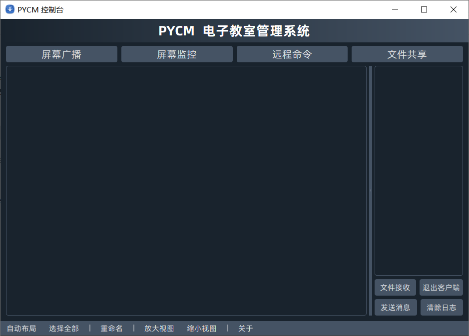
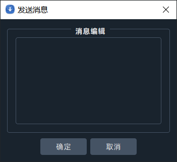
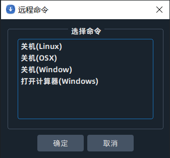
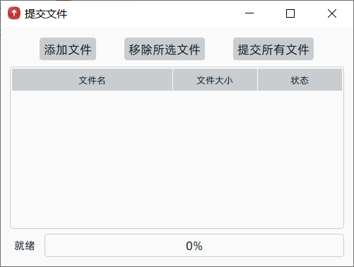

# PYCM 电子教室管理系统

[English](README.md) [简体中文](README.zh-CN.md)

## 镜像仓库

* [Github(主要)](https://github.com/yangzhongtian001/PYCM)
* [Gitee(镜像)](https://gitee.com/yangzhongtian/PYCM)
* [Gitlab(镜像)](https://gitlab.com/yangzhongtian/PYCM)
* [Coding(镜像)](https://yangzhongtian.coding.net/public/PYCM/PYCM/git/files)

## 简介

此程序为一个使用Python编写的电子教室管理系统，包含 `Client(学生端)` 和 `Console(教师端)`。图形界面由 `PyQt5` 编写，支持所有平台。

## 功能

* [x] 局域网自动上线
* [x] 教师端屏幕广播
* [x] 教师端屏幕监控
* [X] 教师端文件共享
* [x] 学生端文件提交
* [x] 教师端消息发送
* [ ] 学生端消息发送
* [x] `Nuitka` 编译发布

## 程序

* **Client(学生端):** 用于多个用户，例如：学生、访客。
* **Console(教师端):** 用于一个用户，例如：教师、主持人。

## 发布版安装指南

* 下载发布版本于 [这里](https://github.com/yangzhongtian001/PYCM/releases)
* 运行 `ConsoleMain` 或 `ClientMain`

## 源码版安装指南

* 克隆此仓库
* 运行 `pip install -r requirements.txt` 以安装依赖组件
* 运行 `python ConsoleMain.py` 或 `python ClientMain.py` 以启动程序

## 截图

### Console(教师端)

### Client(学生端)

## 已知问题
1. 由于某些编译问题，目前仅提供 Windows 版二进制文件。如果你想要在 macOS 或 Linux 上使用，请考虑 [源码安装](#源码版安装指南)。
2. 屏幕捕获功能在某些分辨率下会有异常。

## 联系

* 作者：Richard Yang
* 邮箱：zhongtian.yang@qq.com
* 学校：北京十一学校
* 社团：HCC Computer Community

---

